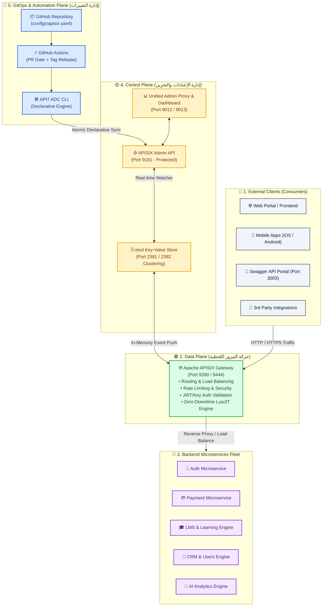

# 🏛️ المعمارية الإجمالية لمنظومة بوابة الخدمات (APISIX System Architecture)
### Enterprise Architecture Overview — Qyadati API Management Platform

---

## 🎯 1. الرؤية المعمارية العامة (Architectural Overview)

تعتمد منظومة **Qyadati API Gateway** على معمارية معيارية سحابية ثلاثية المستويات (**Three-Plane Architecture**) تفصل حركة مرور البيانات للمستخدمين عن إدارة الإعدادات وعن منظومة الـ GitOps:



---

## 🏗️ 2. تفكيك المستويات المعمارية الثلاثة (The Three Planes)

### 🟢 1. مستوى البيانات (Data Plane — Live Traffic)
- **المهمة:** استقبال ومعالجة وتوجيه كافة طلبات المستخدمين (Incoming API Requests) بسرعة خارقة مع زمن استجابة أقل من 1 ميللي ثانية (Sub-millisecond Latency).
- **المكونات الأساسية:**
  - **Apache APISIX Core:** محرك مبني على Nginx + LuaJIT.
  - **Port 9280 (HTTP) & Port 9444 (HTTPS):** منافذ استقبال المرور العام.
  - **Shared Memory:** ذاكرة رام مشتركة بين الـ Workers بدون الحاجة لقراءة الديسك.

---

### 🟡 2. مستوى التحكم (Control Plane — State Management)
- **المهمة:** إدارة الحالة وتخزين الإعدادات وتوفير واجهات الأدمن للتحكم والمراقبة.
- **المكونات الأساسية:**
  - **APISIX Admin API (Port 9181):** واجهة برمجية محمية بمفاتيح سرية لتعديل الـ Gateway برمجياً.
  - **etcd Cluster (Port 2381 / 2382):** قاعدة بيانات موزعة فائقة السرعة تعمل بنظام Raft Consensus، وتوفر ميزة الـ Event Watcher لإشعار الـ Gateway بأي تعديل لحظياً.
  - **Admin Proxy & Dashboard (Port 9012 / 9013):** لوحة تحكم بصرية لمتابعة الحالة ومراقبة السيرفرات.

---

### 🔵 3. مستوى أتمتة الـ GitOps (GitOps & Automation Plane)
- **المهمة:** إدارة التغييرات على الـ Gateway وفق معايير هندسة البرمجيات الاحترافية (Infrastructure as Code).
- **المكونات الأساسية:**
  - **Declarative Spec (`configs/apisix.yaml`):** تعريف المسارات والخدمات والـ Upstreams كملف كود في Git.
  - **PR Gate (`pr-gate.yml`):** بوابة فحص أمني وتدقيق للـ Schema قبل الدمج في `main`.
  - **API7 ADC (APISIX Declarative CLI):** المحرك الذكي الذي يحسب الفروقات (Diff) ويقوم بالنشر بـ Zero Downtime.
  - **Release Pipeline (`release.yml`):** النشر التلقائي المعتمد على الـ Git Tags والـ 1-Click Rollback.

---

## 🔒 3. نموذج الأمان والعزل (Security & Network Isolation)

```text
[ Internet / Public Network ]
            │
            ▼
    ┌───────────────┐
    │  Port 9280/9443 │ ──▶ (Public Data Plane - Only APIs Allowed)
    └───────────────┘
            │
[ Internal Protected VPC Network ]
            │
            ├────▶ Port 9181 (Admin API - Only Accessible via GitHub Actions / VPN)
            ├────▶ Port 2381 (etcd - Isolated Internal Clustering Only)
            └────▶ Backend Microservices (Private Docker Bridge / Internal IPs)
```

1. **عزل الـ Admin API:** منفذ الأدمن (9181) ومخزن etcd (2381) لا يتم تعريضهما للإنترنت العام، ويقتصر الاتصال بهما على الـ CI/CD Pipeline المشفر أو الـ Internal Network.
2. **Zero Hardcoded Secrets:** كافة المفاتيح وأسرار التشغيل تُحقن وقت التشغيل عبر **GitHub Secrets** و **Environment Variables (`.env`)**.

---

## ⚡ 4. الخصائص الهندسية الاستراتيجية للنظام (Key Architectural Qualities)

| الخاصية الهندسية | كيف يحققها النظام؟ |
|---|---|
| **Zero-Downtime Deployment** | عبر معمارية etcd Event Watchers؛ أي تعديل يطبق في الـ In-Memory فوراً بدون إعادة تشغيل الـ Nginx Processes. |
| **High Availability (HA)** | إمكانية عمل Scale أفقي لأكثر من حاوية APISIX ترتبط جميعها بنفس الـ etcd Cluster. |
| **Auditability & Traceability** | كل تعديل في الـ Routing Rules مسجل في تاريخ الـ Git Commits ومرتبط بـ Git Tag رسمي وشخص محدد. |
| **Instant Disaster Recovery** | إمكانية استرجاع أي حالة مستقرة سابقة (Rollback) في أقل من 5 ثوانٍ عبر الـ Git Versioning. |
| **Declarative Ownership** | فصل إعدادات الـ Infrastructure الأساسية عن مسارات التطبيقات اليومية لفرق التطوير. |
