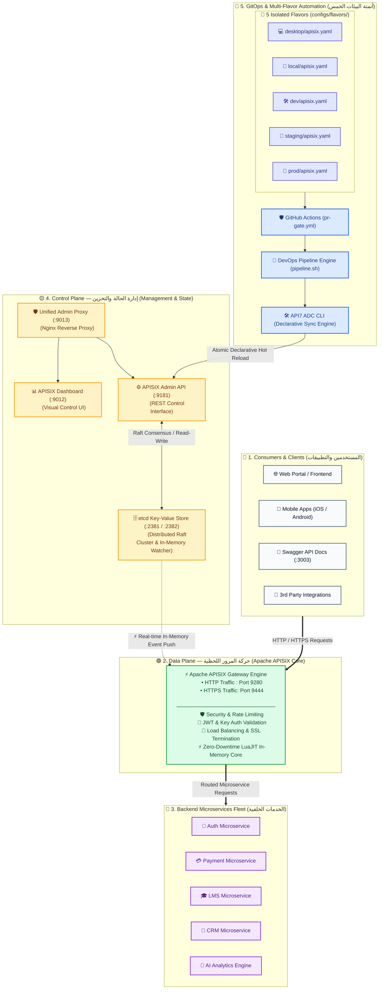

# 🌐 Qyadati APISIX — Multi-Flavor GitOps Platform
### Enterprise API Gateway Architecture with ADC, Semantic Versioning & Instant Rollback

---

## 🌟 نظرة عامة (Overview)

يمثل هذا المشروع البنية التحتية المتكاملة لمنظومة **Qyadati API Gateway** المعتمدة على **Apache APISIX** بنمط **GitOps** المتقدم.
يتميز المشروع بفصل مسارات وإعدادات البوابة إلى **5 بيئات معزولة تماماً (Flavors)**:

1. 💻 **Desktop:** بيئة المطور الشخصية واللابتوب (Docker Desktop / `localhost` / `host.docker.internal`).
2. 🏢 **Local Server:** سيرفر محلي داخل مقر الشركة (On-Premise LAN / IP محلي e.g. `192.168.1.50`).
3. 🛠️ **Dev Server:** سيرفر التطوير السحابي المشترك (Cloud Dev).
4. 🧪 **Staging:** سيرفر اختبارات الجودة والتكامل (QA / UAT).
5. 🚀 **Production:** سيرفر الإنتاج الفعلي المحمي داخل AWS VPC.

---

## 🏛️ 1. معمارية المنظومة الشاملة (System Architecture)

تعتمد المنظومة على معمارية سحابية ثلاثية المستويات (**3-Plane Architecture**) تفصل حركة مرور البيانات عن إدارة الإعدادات وعن أتمتة الـ GitOps:



---

### 🧱 تفكيك المستويات المعمارية الثلاثة (The Three Planes):

1. **🟢 1. مستوى البيانات (Data Plane — Port 9280 / 9444):**
   - استقبال وتوجيه كافة طلبات الـ HTTP/HTTPS بسرعة فائقة (Sub-millisecond Latency) عبر محرك Nginx + LuaJIT.
   - تطبيق الـ Authentication والـ Rate Limiting والـ IP Whitelist وعزل الخدمات.
2. **🟡 2. مستوى التحكم (Control Plane — Port 9181 / 9012 / 9013 / 2381):**
   - **Admin API (9181):** واجهة التحكم البرمجية المحمية بمفاتيح سرية.
   - **etcd Cluster (2381/2382):** قاعدة بيانات موزعة فائقة السرعة تدعم تقنية `Event Watcher` لنقل أي تعديل لحظياً لذاكرة البوابة.
   - **Admin Proxy & Dashboard (9013/9012):** لوحة تحكم بصرية لمتابعة الحالة ومراقبة السيرفرات.
3. **🔵 3. مستوى أتمتة الـ GitOps (GitOps & Multi-Flavor Automation):**
   - إدارة المسارات كملفات كود (`configs/flavors/`).
   - فحص الـ PRs آلياً عبر `pr-gate.yml` والمزامنة عبر أداة `API7 ADC`.

---

## 🚀 2. آلية وطريقة النشر المتبعة (How Deployment Works)

يعتمد المشروع على المعيار القياسي العالمي **(Tag-Driven GitOps Deployment)**:
حيث يتم إنشاء الـ **Git Tag** على GitHub أولاً ➔ ثم يقوم سيرفر الإنتاج بسحب وتطبيق هذا الـ Tag المحدد بدون توقف للخدمة.

```mermaid
flowchart TD
    %% Styling
    classDef dev fill:#e0e7ff,stroke:#6366f1,stroke-width:2px,color:#1e1b4b;
    classDef git fill:#f1f5f9,stroke:#64748b,stroke-width:2px,color:#0f172a;
    classDef gate fill:#fef3c7,stroke:#f59e0b,stroke-width:2px,color:#78350f;
    classDef prod fill:#dcfce7,stroke:#16a34a,stroke-width:2px,color:#14532d;
    classDef rollback fill:#fee2e2,stroke:#ef4444,stroke-width:2px,color:#7f1d1d;

    subgraph DevPhase [" 💻 1. مرحلة التطوير وفحص الـ PR "]
        DEV["تعديل المسارات في configs/flavors/"]:::dev
        PR["فتح Pull Request لفرع main"]:::dev
        GATE["🛡️ PR Gate: فحص الـ 5 بيئات بالتوازي\n(pr-gate.yml)"]:::gate
        MERGE["الموافقة والدمج في main"]:::dev
    end

    subgraph TagPhase [" 🏷️ 2. إنشاء رقم الإصدار (Tagging) "]
        TAG["إنشاء Git Tag رسمي مستقر\n(e.g. git tag -a v1.2.0)"]:::git
        PUSH_TAG["رفع الـ Tag إلى المستودع\ngit push origin v1.2.0"]:::git
    end

    subgraph ProdDeploy [" 🚀 3. النشر المباشر على سيرفر الإنتاج "]
        PULL_TAG["سحب الـ Tag على السيرفر\n./devops/scripts/pipeline.sh prod pull"]:::prod
        CHECKOUT["الانتقال التلقائي لأحدث Tag\n(git checkout tags/v1.2.0)"]:::prod
        VALIDATE["فحص السكيما والمقارنة\n(adc validate & adc diff)"]:::prod
        BACKUP["أخذ نسخة احتياطية من etcd\n(Pre-deploy Snapshot)"]:::prod
        HOT_SYNC["تطبيق التعديلات بدون توقف\n(Zero-Downtime Hot Reload)"]:::prod
        HEALTH["فحص صحة البوابة وتوثيق العملية\n(Health Check & Audit Log)"]:::prod
    end

    subgraph RollbackPhase [" ⏪ 4. الاسترجاع الفوري عند الطوارئ "]
        RB["استرجاع فوري لنسخة سابقة بأمر واحد\n./devops/scripts/pipeline.sh prod rollback v1.1.0"]:::rollback
    end

    DEV --> PR --> GATE --> MERGE --> TAG --> PUSH_TAG --> PULL_TAG
    PULL_TAG --> CHECKOUT --> VALIDATE --> BACKUP --> HOT_SYNC --> HEALTH
    HEALTH -.->|في حال حدوث خطأ بيزنس| RB
```



---

### 🔍 تفاصيل خطوات النشر خطوة بخطوة:

#### 1️⃣ الخطوة الأولى: فحص الـ Pull Request التلقائي (PR Gate)
- عند فتح أي PR يستهدف فرع `main`، يعمل الـ GitHub Action ([pr-gate.yml](file:///.github/workflows/pr-gate.yml)) تلقائياً.
- يتم فحص ملفات التكوين لجميع الـ 5 بيئات بالتوازي باستخدام أداة `adc validate` لمنع أي أخطاء في الـ Syntax.

#### 2️⃣ الخطوة الثانية: إنشاء الـ Git Tag الرسمي
- بعد دمج الكود في `main`، يتم إنشاء Release Tag يمثل إصداراً مستقراً ومعتمداً:
  ```bash
  git tag -a v1.2.0 -m "Release v1.2.0: Update production routing"
  git push origin v1.2.0
  ```

#### 3️⃣ الخطوة الثالثة: النشر على سيرفر الإنتاج (Production Pull & Sync)
- يقوم مهندس الـ DevOps بتشغيل أمر السحب على سيرفر الإنتاج:
  ```bash
  ./devops/scripts/pipeline.sh prod pull
  ```
- **ما يقوم به السكربت داخلياً بشكل تلقائي وآمن:**
  1. `git fetch --tags`: يجلب قائمة الإصدارات المحدثة من GitHub.
  2. `git checkout tags/v1.2.0`: ينتقل تلقائياً لآخر Tag رسمي مستقر تم رفعه.
  3. `adc validate`: يتحقق من سلامة ملف `configs/flavors/prod/apisix.yaml`.
  4. `adc diff`: يقارن التغييرات الجديدة مع الإعدادات الحية الحالية على البوابة.
  5. `etcd backup`: يأخذ لقطة احتياطية كاملة (Snapshot) لقاعدة بيانات `etcd` في مجلد `devops/backups/etcd/`.
  6. `adc sync`: يطبق الإعدادات فوراً بتقنية **Zero-Downtime Hot Reload** دون إعادة تشغيل الحاويات.
  7. `Health Check & Logging`: يفحص استجابة البوابة ويسجل تفاصيل النشر في `devops/deployments.log`.

---

## ⚖️ 3. لماذا نعتمد "Tag على GitHub أولاً"؟

| وجه المقارنة | 🥇 إنشاء الـ Tag على GitHub أولاً (المعتمد بالمشروع) | ❌ إنشاء Tag تلقائي بعد السحب على السيرفر |
| :--- | :--- | :--- |
| **مرجعية الكود (Source of Truth)** | **GitHub هو المرجع الوحيد**، كل سطر في الإنتاج معروف مصدره ورقم إصداره. | مشتت، السيرفر هو الذي يولد الإصدارات بعد التنفيذ. |
| **أمان السيرفر (Security)** | **أعلى أمان**: سيرفر الإنتاج يحتاج صلاحية **قراءة فقط (Read-Only)**. | **مخاطرة أمنية**: السيرفر يحتاج صلاحيات `write/push` على الـ Git! |
| **تعدد السيرفرات (Clustering)** | لو وجد أكثر من سيرفر إنتاج، تسحب جميعها نفس الـ Tag تماماً بدون تعارض. | حدوث تعارض (Conflict) لمحاولة كل سيرفر إنشاء Tag مستقل. |
| **الاسترجاع الفوري (Rollback)** | سهل وفوري بالرجوع لأي Tag سابق (`rollback v1.1.0`). | معقد وعرضة للأخطاء وفقدان التتبع. |

---

## 🛠️ 4. دليل أوامر التشغيل الميداني (Operations Cheat Sheet)

### 💻 1. للمطورين (Local Development):
```bash
# 1. تشغيل مكدس APISIX محلياً:
./scripts/start.bat    # Windows
./scripts/start.sh     # Linux / Mac

# 2. فتح لوحة التحكم الرسومية المتقدمة (GUI Manager):
python scripts/gui_manager.py

# 3. مزامنة إعدادات بيئة معينة محلياً:
./scripts/sync.bat desktop
# أو عبر بايثون مباشرة:
python scripts/sync-gateway.py desktop
```

---

### 🚀 2. لمهندسي الـ DevOps على سيرفر الإنتاج (Production Operations):

يتم تنفيذ كافة العمليات عبر المحرك الشامل [devops/scripts/pipeline.sh](file:///f:/Qyadati/apisix/multi-single/devops/scripts/pipeline.sh):

```bash
# 1. سحب وتطبيق أحدث Stable Git Tag تلقائياً على الإنتاج:
./devops/scripts/pipeline.sh prod pull

# 2. نشر أو استهداف Release Tag محدد بالاسم:
./devops/scripts/pipeline.sh prod v1.2.0

# 3. الاسترجاع الفوري (Instant Rollback) لنسخة مستقرة سابقة:
./devops/scripts/pipeline.sh prod rollback v1.1.0

# 4. عرض قائمة جميع الـ Tags المسجلة في المستودع:
./devops/scripts/pipeline.sh list-tags

# 5. سحب وتطبيق الإعدادات على سيرفرات التجارب (Staging / Dev):
./devops/scripts/pipeline.sh staging pull
./devops/scripts/pipeline.sh dev pull
```

---

## 🔐 5. إعدادات ملف البيئة (.env & .env.example)

الملف [.env](file:///.env) يحتوي على الإعدادات الحيوية لمنظومة APISIX ومقسم إلى 7 أقسام مشروحة بالكامل:

| القسم | المتغيرات الرئيسية | الوظيفة |
| :--- | :--- | :--- |
| **1. Active Flavor** | `ACTIVE_FLAVOR` | تحديد البيئة الحالية (`desktop`, `local`, `dev`, `staging`, `prod`) |
| **2. Container & Host** | `APISIX_HOST`, `CONTAINER_PREFIX` | بادئة أسماء حاويات Docker وعنوان المضيف |
| **3. Security & Auth** | `ADMIN_KEY`, `DASHBOARD_PASS`, `ETCD_CLUSTER_TOKEN` | توكن الـ Admin API وبيانات الدخول للوحة التحكم |
| **4. Service Ports** | `APISIX_HTTP_PORT` (9280), `APISIX_ADMIN_PORT` (9181), `ADMIN_PROXY_PORT` (9013), `CLASSIC_DASHBOARD_PORT` (9012) | منافذ حركة المرور والإدارة |
| **5. Docker Images** | `APISIX_IMAGE`, `ETCD_IMAGE`, `DASHBOARD_IMAGE`, `ADMIN_PROXY_IMAGE` | صور وإصدارات الحاويات المستخدمة |
| **6. ADC Config** | `ADC_VERSION`, `ADC_BACKEND` | إصدار أداة Declarative CLI |
| **7. Flavor Endpoints** | `DESKTOP_*`, `LOCAL_*`, `DEV_*`, `STAGING_*`, `PROD_*` | مسارات ملفات الـ YAML وروابط الـ Admin API لكل بيئة |

---

## 📝 6. خطوات إنشاء وإدارة الـ Git Tags

### 🅰️ الطريقة الأولى: عبر التيرمينال (Terminal)
```bash
# 1. التأكد من الوقوف على فرع main المحدث
git checkout main
git pull origin main

# 2. إنشاء Tag جديد برقم الإصدار (Semantic Versioning)
git tag -a v1.2.0 -m "Release v1.2.0: Added Payments and Auth routes"

# 3. رفع الـ Tag إلى GitHub
git push origin v1.2.0
```

### 🅱️ الطريقة الثانية: عبر واجهة GitHub (Web UI)
1. ادخل على صفحة المستودع في GitHub.
2. توجه إلى قسم **Releases** ➔ اضغط **Draft a new release**.
3. اكتب رقم الـ Tag (مثال: `v1.2.0`) واضغط **Create new tag**.
4. اكتب وصف الإصدار واضغط **Publish release**.

---

## 📂 7. هيكل ملفات المشروع (Project Structure)

```text
f:/Qyadati/apisix/multi-single/
│
├── 📁 .github/                      # أتمتة الـ CI/CD
│   └── workflows/
│       └── pr-gate.yml              # 🛡️ فحص الـ 5 بيئات بالتوازي قبل الـ Merge
│
├── 📁 apisix/                       # إعدادات حاوية APISIX
│   ├── config.yaml                  # ضبط النواة والـ Ports والـ Plugins
│   └── ui/index.html                # واجهة ويب خفيفة للبوابة (/ui/)
│
├── 📁 bin/                          # الأدوات التنفيذية
│   └── adc.exe                      # محرك API7 ADC للمزامنة وفحص الفروقات
│
├── 📁 configs/                      # قلب مسارات وخدمات المنظومة
│   ├── apisix.yaml                  # ملف الإعداد الموحد (Single Mode)
│   └── 📁 flavors/                  # مجلد الـ 5 بيئات المعزولة (Multi-Flavor):
│       ├── 📁 desktop/apisix.yaml   # 💻 لابتوب المطور الشخصي
│       ├── 📁 local/apisix.yaml     # 🏢 سيرفر الشبكة المحلية للشركة (LAN)
│       ├── 📁 dev/apisix.yaml       # 🛠️ سيرفر التطوير السحابي
│       ├── 📁 staging/apisix.yaml   # 🧪 سيرفر اختبارات الجودة (QA)
│       └── 📁 prod/apisix.yaml      # 🚀 سيرفر الإنتاج الحقيقي (AWS)
│
├── 📁 dashboard/                    # إعدادات لوحة التحكم الكلاسيكية (Port 9012)
├── 📁 nginx/                        # إعدادات الـ Unified Admin Proxy (Port 9013)
│
├── 📁 devops/                       # 🛠️ مساحة عمل مهندسي البنية التحتية
│   ├── deployments.log              # سجل تدقيق تاريخ عمليات النشر والـ Rollback
│   ├── 📁 backups/etcd/             # النسخ الاحتياطية التلقائية لقاعدة البيانات
│   └── 📁 scripts/
│       └── pipeline.sh              # 🚀 المحرك الشامل للنشر والـ Rollback والباك اب
│
├── 📁 scripts/                      # أدوات الإدارة للمطورين
│   ├── gui_manager.py               # 🖥️ واجهة سطح مكتب رسومية للتحكم بالـ Flavors
│   ├── sync-gateway.py              # محرك بايثون للمزامنة المحلية
│   ├── start.bat / start.sh         # تشغيل الحاويات
│   └── stop.bat / stop.sh           # إيقاف الحاويات
│
├── 🐳 docker-compose.yml            # مكدس الدوكر للخدمات الأربعة
├── ⚙️ .env / .env.example           # ملف المنافذ والمتغيرات السرية المشروح
└── 📖 README.md                     # الدليل الشامل والمعمارية الموحدة للمنظومة
```

---

## 👥 8. مصفوفة المسؤوليات (RACI Matrix)

| الدور | المسؤولية |
|---|---|
| **المطور (Developer)** | تعديل المسارات محلياً في `desktop/apisix.yaml`، واختبارها عبر `scripts/sync.bat` أو الـ GUI، ثم فتح Pull Request. |
| **قائد الفريق (Tech Lead)** | مراجعة الـ PR والتأكد من اجتياز فحص `pr-gate.yml` ثم دمج الكود في `main`. |
| **مهندس الـ DevOps** | إنشاء الـ Git Tag الرسمي، وسحب الإصدار على سيرفر الإنتاج عبر `./devops/scripts/pipeline.sh prod pull` وإجراء الـ Rollback في حالات الطوارئ. |
