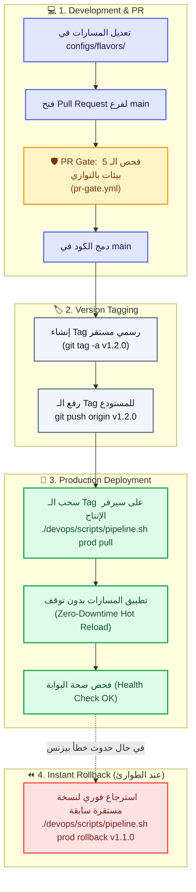

# 🌐 Qyadati APISIX — Multi-Flavor GitOps Platform
### Enterprise API Gateway Architecture with ADC, Semantic Versioning & Instant Rollback

---

## 🌟 نظرة عامة (Overview)

يمثل هذا المشروع البنية التحتية لمنظومة **Qyadati API Gateway** المعتمدة على **Apache APISIX** بنمط **GitOps** المتقدم.
يتميز المشروع بفصل مسارات وإعدادات البوابة إلى **5 بيئات معزولة تماماً (Flavors)** + نمط موحد (Single Mode):

1. 💻 **Desktop:** بيئة المطور الشخصية واللابتوب (Docker Desktop / `host.docker.internal`).
2. 🏢 **Local Server:** سيرفر محلي داخل مقر الشركة (On-Premise LAN / IP محلي).
3. 🛠️ **Dev Server:** سيرفر التطوير السحابي المشترك.
4. 🧪 **Staging:** سيرفر اختبارات الجودة والتكامل (QA / UAT).
5. 🚀 **Production:** سيرفر الإنتاج الفعلي المحمي في AWS VPC.

---

## 🏷️ دورة إصدارات الـ Git Tags ونشر الإنتاج (Git Tagging & Release Lifecycle)

> [!IMPORTANT]
> **قاعدة ذهبية لفريق العمل:**
> * فروع التطوير (`feature-branch` ➔ `main`) مخصصة لبيئات **Dev** و **Staging**.
> * سيرفر الإنتاج (**Production**) **لا يستقبل أي كود إلا عبر Git Tag رسمي ومستقر (e.g. `v1.0.0`)**.



---

## 🛠️ دليل أوامر التشغيل والنشر الميداني (Operations Cheat Sheet)

### 💻 1. للمطورين (Local Development):
```bash
# تشغيل حاويات APISIX محلياً:
./scripts/start.bat    # Windows
./scripts/start.sh     # Linux / Mac

# فتح واجهة التحكم الرسومية (GUI Manager):
python scripts/gui_manager.py

# مزامنة وتطبيق بيئة الـ Desktop:
./scripts/sync.bat desktop
```

---

### 🚀 2. لمهندسي الـ DevOps على سيرفر الإنتاج (Production Operations):

يتم تنفيذ كافة العمليات عبر المحرك الشامل [devops/scripts/pipeline.sh](file:///f:/Qyadati/apisix/multi-single/devops/scripts/pipeline.sh):

```bash
# 1. سحب وتطبيق أحدث Stable Git Tag تلقائياً على الإنتاج:
./devops/scripts/pipeline.sh prod pull

# 2. تطبيق Release Tag محدد بالاسم:
./devops/scripts/pipeline.sh prod v1.2.0

# 3. عمل استرجاع فوري (Instant Rollback) لنسخة مستقرة سابقة:
./devops/scripts/pipeline.sh prod rollback v1.1.0

# 4. عرض قائمة جميع الـ Tags الرسمية المسجلة:
./devops/scripts/pipeline.sh list-tags

# 5. تشغيل النشر على سيرفرات التجارب (Staging / Dev):
./devops/scripts/pipeline.sh staging pull
./devops/scripts/pipeline.sh dev pull
```

---

## 📝 خطوات إنشاء وإدارة الـ Git Tags لفريق العمل

### 🅰️ الطريقة الأولى: عبر أوامر الـ Git (Terminal)
```bash
# 1. التأكد من الوقوف على فرع main المحدث
git checkout main
git pull origin main

# 2. إنشاء Tag جديد برقم الإصدار (Semantic Versioning)
git tag -a v1.2.0 -m "Release v1.2.0: Added LMS and Payments microservice routes"

# 3. رفع الـ Tag إلى المستودع البعيد (GitHub)
git push origin v1.2.0
```

### 🅱️ الطريقة الثانية: عبر واجهة GitHub (Web UI)
1. افتح صفحة المستودع على GitHub.
2. اضغط على قسم **Releases** في اليمين ➔ ثم **Draft a new release**.
3. اختر **Choose a tag** واكتب رقم الإصدار (مثال: `v1.2.0`) واضغط **Create new tag**.
4. اكتب وصف التغييرات (Changelog) واضغط **Publish release**.

---

## 📂 هيكل ملفات المشروع بالكامل (Project Structure)

```text
f:/Qyadati/apisix/multi-single/
│
├── 📁 .github/                      # أتمتة الـ CI/CD
│   └── workflows/
│       └── pr-gate.yml              # 🛡️ فحص الـ 5 بيئات بالتوازي قبل الـ Merge
│
├── 📁 apisix/                       # إعدادات حاوية APISIX
│   ├── config.yaml                  # ضبط النواة والـ Ports والـ Plugins
│   └── ui/index.html                # واجهة ويب خفيفة للبوابة
│
├── 📁 bin/                          # الأدوات التنفيذية
│   └── adc.exe                      # محرك API7 ADC للمزامنة وفحص الفروقات
│
├── 📁 configs/                      # قلب مسارات وخدمات المنظومة
│   ├── apisix.yaml                  # ملف الإعداد الموحد (Single Mode)
│   └── 📁 flavors/                  # مجلد الـ 5 بيئات المعزولة (Multi-Flavor):
│       ├── 📁 desktop/apisix.yaml   # 💻 لابتوب المطور الشخصي
│       ├── 📁 local/apisix.yaml     # 🏢 سيرفر الشبكة المحلية للشركة (LAN)
│       ├── 📁 dev/apisix.yaml       # 🛠️ سيرفر التطوير السحابي
│       ├── 📁 staging/apisix.yaml   # 🧪 سيرفر اختبارات الجودة (QA)
│       └── 📁 prod/apisix.yaml      # 🚀 سيرفر الإنتاج الحقيقي (AWS)
│
├── 📁 dashboard/                    # إعدادات لوحة التحكم الكلاسيكية (Port 9012)
├── 📁 nginx/                        # إعدادات الـ Unified Admin Proxy (Port 9013)
│
├── 📁 devops/                       # 🛠️ مساحة عمل مهندسي البنية التحتية
│   ├── README.md                    # دليل مفصل لتشغيل سيرفرات الإنتاج
│   ├── deployments.log              # سجل تدقيق تاريخ عمليات النشر والـ Rollback
│   ├── 📁 backups/etcd/             # النسخ الاحتياطية التلقائية لقاعدة البيانات
│   └── 📁 scripts/
│       └── pipeline.sh              # 🚀 المحرك الشامل للنشر والـ Rollback والباك اب
│
├── 📁 scripts/                      # أدوات الإدارة للمطورين
│   ├── gui_manager.py               # 🖥️ واجهة سطح مكتب رسومية للتحكم بالـ Flavors
│   ├── sync-gateway.py              # محرك بايثون للمزامنة المحلية
│   ├── start.bat / start.sh         # تشغيل الحاويات
│   └── stop.bat / stop.sh           # إيقاف الحاويات
│
├── 🐳 docker-compose.yml            # مكدس الدوكر للخدمات الأربعة
├── ⚙️ .env / .env.example           # ملف المنافذ والمتغيرات السرية
├── 📖 APISIX_SYSTEM_ARCHITECTURE.md # المعمارية الهندسية التفصيلية
└── 📖 DEVOPS_PLAYBOOK.md            # دليل التشغيل الميداني
```

---

## 👥 مسؤوليات أعضاء الفريق (RACI Matrix)

| الدور | المسؤولية |
|---|---|
| **المطور (Developer)** | تعديل المسارات محلياً في `desktop/apisix.yaml`، واختبارها عبر `scripts/sync.bat`، ثم فتح Pull Request. |
| **قائد الفريق (Tech Lead)** | مراجعة الـ PR والتأكد من اجتياز فحص `pr-gate.yml` ثم دمج الكود في `main`. |
| **مهندس الـ DevOps** | إنشاء الـ Git Tag الرسمي، وسحب الإصدار على سيرفر الإنتاج عبر `./devops/scripts/pipeline.sh prod pull` وإجراء الـ Rollback في حالات الطوارئ. |
