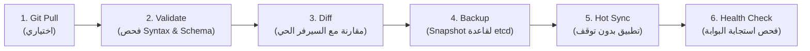

# 🛠️ دليل تشغيل وإدارة البنية التحتية (DevOps Workspace)
### مساحة عمل خاصة بفريق الـ DevOps — منصة Qyadati APISIX

مرحباً بك في مجلد `devops/`. هذا المجلد مخصص بالكامل لمهندسي الـ DevOps والبنية التحتية لإضافة، تعديل، وتخصيص كافة عمليات النشر (Deployment)، السحب (Pull Strategies)، النسخ الاحتياطي (Backups)، وتهيئة السيرفرات دون التدخل في كود ومسارات المطورين.

---

## 📂 هيكل مجلد الـ DevOps (DevOps Directory Structure)

```text
devops/
├── README.md                      # 📖 هذا الدليل الشامل
├── scripts/                       # 📜 محرك الأتمتة الشامل (Pure Bash)
│   └── pipeline.sh                # 🚀 المحرك الكامل لسحب وفحص وتطبيق ونسخ احتياطي للـ Flavor
└── templates/                     # 📦 مساحة مخصصة لإضافة (Helm / Ansible / Terraform / K8s)
```

---

## 🔄 1. دورة النشر الكاملة للـ DevOps (Full DevOps Pipeline)

المنظومة بالكامل مدمجة كـ Pipeline داخلي شامل ينفذه الـ DevOps من عنده عبر `pipeline.sh`:



### ⚡ تشغيل الـ Pipeline بأمر واحد (Pure Bash):

```bash
# منح صلاحيات التشغيل للسكريبت:
chmod +x devops/scripts/pipeline.sh

# 1. على سيرفر الإنتاج (سحب وتطبيق أحدث Stable Git Tag تلقائياً):
./devops/scripts/pipeline.sh prod pull

# 2. على سيرفر الإنتاج (تحديد Release Tag معين بالاسم):
./devops/scripts/pipeline.sh prod v1.2.0

# 3. استرجاع فوري (Rollback) في الإنتاج لإصدار مستقر سابق:
./devops/scripts/pipeline.sh prod rollback v1.1.0

# 4. استعراض كل الـ Git Tags المتاحة في المستودع:
./devops/scripts/pipeline.sh list-tags

# 5. على سيرفرات التجارب (Staging / Dev):
./devops/scripts/pipeline.sh staging pull
./devops/scripts/pipeline.sh dev
```

---

## ⚙️ 2. ضبط المتغيرات السرية على السيرفر (Environment Configuration)

على أي سيرفر، الـ DevOps بيعمل خطوة واحدة فقط:
1. نسخ ملف القالب الأساسي `.env.example` إلى `.env`:
   ```bash
   cp .env.example .env
   ```
2. تعديل المتغيرات المناسبة للسيرفر (مثل `ACTIVE_FLAVOR=prod`، البورتات، ومفتاح الـ `ADMIN_KEY`).

